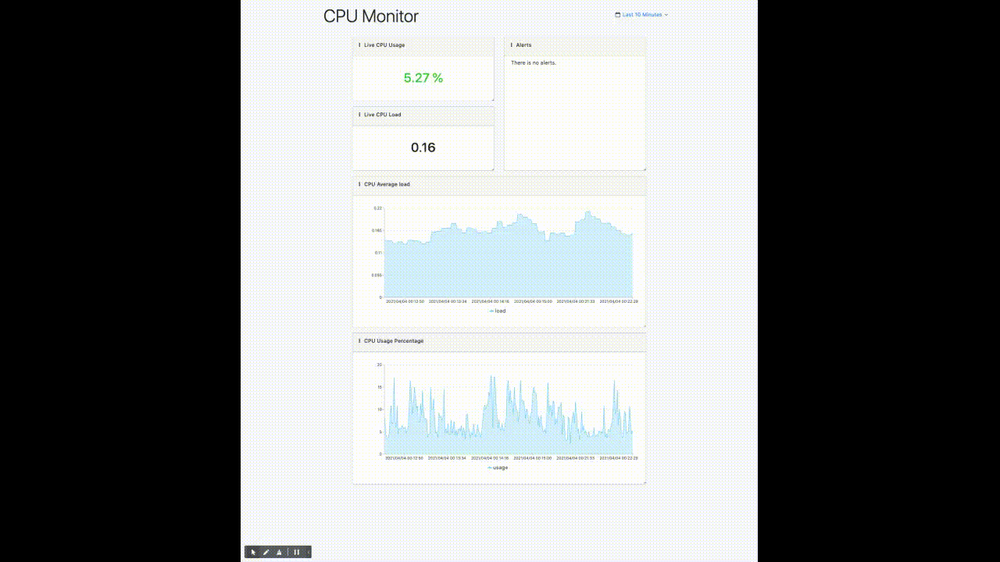

# cpu-monitor

cpu-monitor is an application created to monitor the CPUs usage and load average. It provides metrics, visualizations and real-time alerts to analyze and monitor the CPUs.



## Requirements 

The project was designed and is intended to run with `Node >=14` on a [Unix-Like](https://en.wikipedia.org/wiki/Unix-like) operating system.

To be able to run this application locally, please make sure your have:

* [Git](https://git-scm.com/)
* [Node.js (>= 14)](https://nodejs.org)
* [Yarn](https://yarnpkg.com)

For simplicity we also provide an installation through Docker. To be able to use Docker please make sure you have `Docker` and `docker-compose` installed on your machine.

## Installation
### Without using Docker

Before we can run the server and the dashbaord, we need to install all the dependecies.

Install the server dependecies :
```
cd server
yarn install --pure-lockfile
```

Install the dashboard dependecies :
```
cd dashboard
yarn install --pure-lockfile
```

After the commands has finished, we can start running our server and dashboard:

Run the server :
```
cd server
yarn start
```

Run the dashboard :
```
cd dashboard
yarn start
```

*NOTE*: We also mprovide a `Makefile` to make it easier to build and run the project.

**To run the porject using `Make`**

```
make deps
make run
```

### With using Docker

To run the application in Docker, you can use `docker-compose` :
```
docker-compose up
```

## Testing
### Automated mock testing

We have an automated mock testing written using `jest` testing framework.

To run the automated tests:
```
cd dashboard
yarn test
```

or simply using make:
```
make test
```

These tests will mock CPU metrics and check if the dashboard displays correctly the high load and recover alerts.

### Live stress testing

Before running the live stress tests please make sure that the prject is perfectly running and that you can open it in the browser: [http://localhost:4100](http://localhost:4100).

We will need three commands :
* [stress](https://linux.die.net/man/1/stress)
* [timeout](https://linux.die.net/man/1/timeout)
* [nproc](https://linux.die.net/man/1/nproc)

To run the live stress testing:
```
timeout 3m stress --cpu $(nproc --all)
```
This command will produce a high load on the CPUs. Watch the dashboard to track the metrics.

## Project structure

The project is split into two parts:
* The server: [server](./server)
* The dashboard: [dashboard](./dashboard)

### Server
The server is responsible for collecting metrics and storing them in a timeseries structure.
Following are the different parts of the server:
* **Monitors**:
The monitors are runnable modules that collects the metrics. The monitors should have a `metrics` method that returns metrics in a timeseries format:
```
[
  {
    metric1: value1,
    metric2: value2,
    ...
    timestamp: timestamp
  },
  ...
]
```

All the monitors should be the [./server/monitors](./server/monitors) directory to be loaded automatically during the startup of the server.

* **Data storage**:
The data storage is responsible for storing and retrieving the timeseries data.
An example of a file data storage system: [./server/core/db.js](./server/core/db.js).
This data storage creates a directory trees based on the timestamp and splits over the metrics over these directories.
Following is an example:
```
- metrics-db
  - 2021                      # The year
    - 2                       # The month
      - 31                    # The day
        - 12                  # The hour
          - cpu_monitor.idle  # The cpu_monitor idle metric
          - cpu_monitor.load  # The cpu_monitor load metric
          - cpu_monitor.total # The cpu_monitor total metric
```

### Dashboard
The dashboard is a React applicatin that collects metrics during specific time period and displays it.
In the dashboard we have 5 charts:

***Live CPU Usage***: Shows the current CPUs usage percentage. The color of the metric indicates if the CPU is on a high load.

***Live CPU Load***: Shows the current CPUs load average.

***Alerts***: Show a list of alerts. We have two type of alerts:
* High Load Alert: when the load average is more or equal to 1 for 2 minutes of more.
* Recover Alert: when the load average is less the 1 or 2 minutes for more.

***CPU Average load***: Shows a chart of the CPUs average load during the selected period of time.

***CPU Usage Percentage***: Shows a chart of the CPUs usage percentage during the selected period of time.

**CUSTOMIZATION**:

* Flexible layout: The dashboard is a flexible grid layout so that we can customize the size and the position of all the charts.
* We can customize some environements variables: `BACKEND_URL` to change the data source.
`HIGH_LOAD_THRESHOLD` to edit the high load threshold.


